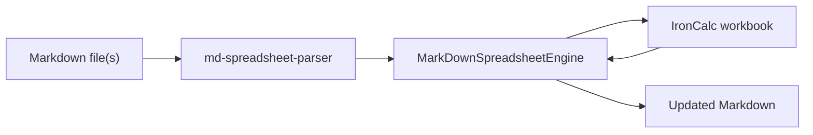

# Markdown Spreadsheet Engine

**Spreadsheet formulas in plain Markdown tables — computed by [IronCalc](https://github.com/ironcalc/IronCalc), parsed by [md-spreadsheet-parser](https://github.com/fy-labs/md-spreadsheet-parser).**

Write `=SUM(B1:B3)` inside a GitHub-flavoured table, run one command, and get back the same document with live results appended next to each formula. Headings, paragraphs, lists, and everything outside the tables stay untouched.

```markdown
| <!-- table:sales --> Item | Qty | Price | Total              |
| :---                      | :-: | ----: | ---:               |
| Widgets                   | 5   | 10.00 | <!-- =B1*C1 --> 50 |
```

---

## Why this exists

Markdown is great for docs and version control, but terrible for numbers that change. This engine closes that gap without introducing a proprietary format:

- Formulas live inside HTML comments — invisible in rendered Markdown previews
- Calculated values are written back as plain text — readable everywhere
- Multiple tables and multiple files can reference each other like spreadsheet tabs
- The full IronCalc function library is available (`SUM`, `IF`, `VLOOKUP`, …)

---

## How it works



1. **Parse** — split the document into text blocks and tables
2. **Map** — assign each table a virtual IronCalc sheet (`doc:table → Sheet0`)
3. **Evaluate** — run all formulas in dependency order
4. **Regenerate** — write results back, re-align column widths, preserve everything else

---

## Installation

Requires **Python 3.10+**.

```bash
pip install markdown-spreadsheet-engine
```

From source:

```bash
git clone https://github.com/mguillau/markdown-spreadsheet-engine.git
cd markdown-spreadsheet-engine
pip install -e ".[test]"
```

---

## Quick start

### Command line

Process a file and print the result to stdout:

```bash
md-calc report.md
```

Pipe from stdin:

```bash
cat report.md | md-calc -n my_report
```

Process several files that reference each other:

```bash
md-calc -n inventory inventory.md -n summary summary.md
```

| Flag | Description |
|------|-------------|
| `-n`, `--doc-name` | Logical document name used in cross-file references (repeat per file) |
| `-v`, `--verbose` | Print INFO-level logs to stderr |
| `-t`, `--test` | Run a built-in smoke test |

### Python API

```python
from md_spreadsheet_engine.engine import MarkDownSpreadsheetEngine

engine = MarkDownSpreadsheetEngine()

engine.load_markdown_document("report", open("report.md").read())
engine.evaluate()
print(engine.regenerate_markdown_document("report"))
```

Load multiple documents before evaluating so cross-file references resolve:

```python
engine = MarkDownSpreadsheetEngine()

engine.load_markdown_document("inventory", open("inventory.md").read())
engine.load_markdown_document("summary",   open("summary.md").read())
engine.evaluate()

print(engine.regenerate_markdown_document("summary"))
```

---

## Syntax

### Table names

Name a table by placing a comment in the **first header cell**. This name is used in cross-table and cross-document references.

```markdown
| <!-- table:pricing --> Item | Qty | Price |
| :---                       | :-: | ----: |
| Widgets                    | 5   | 10.00 |
```

Tables without an explicit name are auto-numbered `table_0`, `table_1`, …

### Formulas

Wrap any IronCalc expression in an HTML comment:

```markdown
| <!-- =B1*C1 --> |
```

After evaluation the engine writes:

```markdown
| <!-- =B1*C1 --> 50 |
```

The comment hides the formula in rendered Markdown; the number after `-->` is what readers see.

### Cell references

Row numbers refer to **data rows** (the header row is not counted):

| Markdown row | Spreadsheet row |
|---|---|
| First data row | `1` |
| Second data row | `2` |

```markdown
| <!-- table:t1 --> Item | Qty | Price | Total              |
| :---                 | :-: | ----: | ---:               |
| Widgets              | 5   | 10.00 | <!-- =B1*C1 --> 50 |
| Gadgets              | 3   | 25.00 | <!-- =B2*C2 --> 75 |
| **Total**            |     |       | <!-- =SUM(D1:D2) --> 125 |
```

---

## Examples

### Example 1 — Invoice table

**Input** (`invoice.md`):

```markdown
# Q1 Invoice

| <!-- table:invoice --> Item   | Qty | Unit price | Line total         |
| :---                        | :-: | ---------: | -----------------: |
| Consulting days             | 10  | 850.00     | <!-- =B1*C1 -->    |
| Travel expenses             | 1   | 320.00     | <!-- =B2*C2 -->    |
| **Subtotal**                |     |            | <!-- =SUM(D1:D2) --> |
```

**Output:**

```markdown
# Q1 Invoice

| <!-- table:invoice --> Item   | Qty | Unit price | Line total              |
| :---                        | :-: | ---------: | --------------------: |
| Consulting days             | 10  | 850.00     | <!-- =B1*C1 --> 8500  |
| Travel expenses             | 1   | 320.00     | <!-- =B2*C2 --> 320   |
| **Subtotal**                |     |            | <!-- =SUM(D1:D2) --> 8820 |
```

The heading and table structure are preserved; only formula cells change.

---

### Example 2 — Cross-table references (same file)

Reference another table by name with `table!cell`:

```markdown
| <!-- table:rates --> Label  | Value |
| :---                      | ----: |
| Base rate                 | 500   |

| <!-- table:calc --> Metric | Result                    |
| :---                     | ------------------------: |
| Adjusted (10 %)          | <!-- =rates!A1 * 0.10 --> |
```

After evaluation, `rates!A1` resolves to `500` and the result cell shows `50`.

Tables can reference each other in any order — IronCalc resolves the dependency graph.

---

### Example 3 — Cross-document references

Pull a value from a table in another file using `doc:table!cell`:

**`inventory.md`** (document name: `inventory`):

```markdown
| <!-- table:stock --> SKU     | Units |
| :---                       | ----: |
| WIDGET-001                 | 120   |
```

**`summary.md`** (document name: `summary`):

```markdown
| <!-- table:overview --> Metric        | Value                              |
| :---                                | ---------------------------------: |
| Units on hand                       | <!-- =inventory:stock!A1 -->       |
| Reorder threshold (50 % of stock)   | <!-- =inventory:stock!A1 * 0.5 --> |
```

Process both files together:

```bash
md-calc -n inventory inventory.md -n summary summary.md > summary_computed.md
```

Quoted form also works: `<!-- = 'inventory:stock'!A1 -->`

---

### Example 4 — Mixed content preserved

Everything outside tables passes through unchanged:

```markdown
# Project budget

Approved by the finance team on 2025-03-01.

| <!-- table:budget --> Line | Amount              |
| :---                     | ------------------: |
| Engineering              | <!-- =1000+500 -->  |

See the [full policy](policy.md) for details.
```

---

## Reference

### Cross-reference syntax

| Pattern | Meaning | Example |
|---|---|---|
| `=B1` | Cell in the current table | `<!-- =B1*C1 -->` |
| `=table!A1` | Cell in another table (same document) | `<!-- =rates!A1 * 2 -->` |
| `=doc:table!A1` | Cell in another document | `<!-- =inventory:stock!A1 -->` |
| `= 'doc:table'!A1` | Quoted cross-document reference | `<!-- = 'main:metrics'!A1 + 15 -->` |

### Python API

| Method | Description |
|---|---|
| `MarkDownSpreadsheetEngine()` | Create a new workbook |
| `load_markdown_document(name, content)` | Parse and register a document |
| `evaluate()` | Run all formulas |
| `regenerate_markdown_document(name)` | Return the computed Markdown string |

---

## Development

```bash
# Create a virtual environment and install
pip install -e ".[test]"

# Run tests
pytest
```

The test suite covers local formulas, cross-table and cross-document references, text preservation, implicit table naming, and formula preprocessing.

---

## Roadmap

- [ ] GitHub Action for automatic recomputation on push
- [ ] PengSheets JSON round-trip compatibility
- [ ] Optional in-place file writing (`--in-place`)

---

## License

Apache-2.0 — see [LICENSE](LICENSE).

## Credits

- [IronCalc](https://github.com/ironcalc/IronCalc) — spreadsheet calculation engine (Rust)
- [md-spreadsheet-parser](https://github.com/fy-labs/md-spreadsheet-parser) — Markdown table parser
